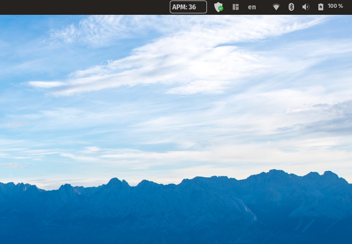

# APM Counter

A GNOME Shell extension that counts the number of actions per minute and displays it in the top bar.



## How to install

```bash
git clone https://github.com/bojan-karlas/apmcounter
cd apmcounter
make install
```
